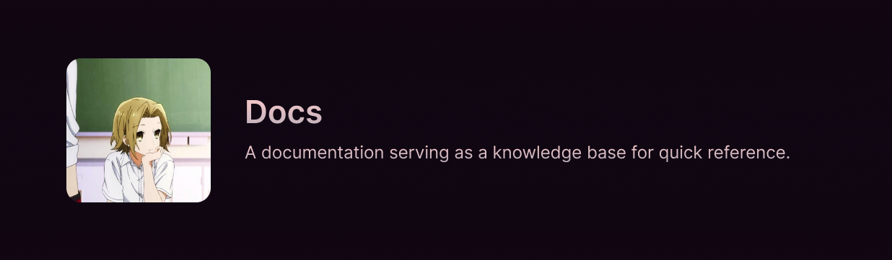

> _Like a fading summer star, rising from the ocean to shine bright~_

## Overview

A personal documentation site built with [Astro](https://astro.build) and [Starlight](https://starlight.astro.build). A comprehensive collection of my most frequently used CLI commands, valuable insights on a wide array of topics, curated bookmarks to fascinating resources, and much more. It serves as a personal knowledge base that I can refer to whenever I need to recall something. I hope you find it useful as well!

Visit the site at [yehezkieldio.vercel.app](https://yehezkieldio.vercel.app).

## License

This project is licensed under the [MIT License](LICENSE). Please refer to the license for more information.
